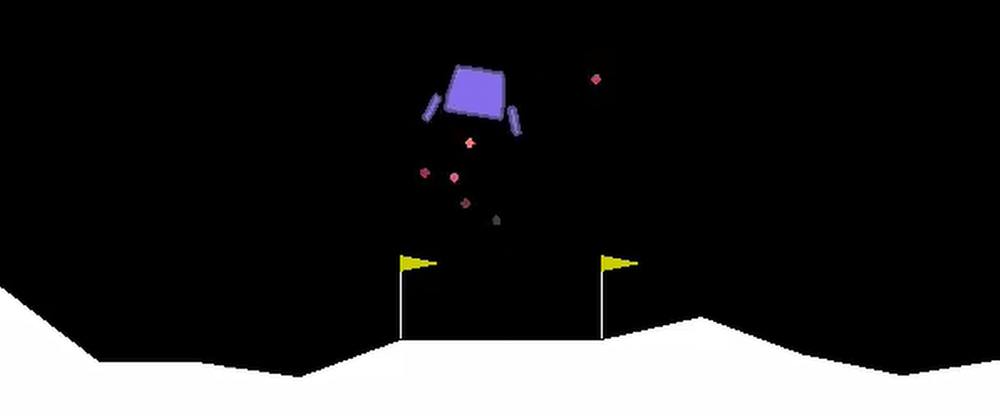

# Demo of DQN and Extensions

See `agents.py` to see DQN, Double DQN and Prioritiesed Experience replay for the Lunar Lander Environment. I was not able to get prioritsed replay to help the learning process. Perhaps not enough iterations?

Run `bash run.sh` and then navigate to `localhost:9000` on your browser. This will run a Docker container for the project.

## Acknowledgement
Much of the material was covered in the Udacity Deep Reinforecemnt Learning course.